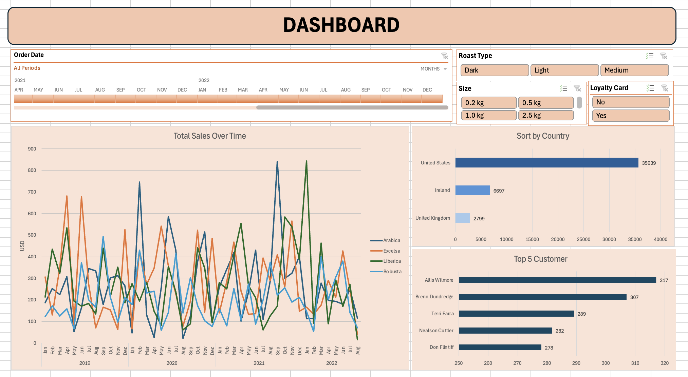

# Sales Analysis Dashboard

This repository contains the **Sales Analysis Dashboard**, developed in August 2024, using Microsoft Excel. The dashboard provides insights into sales performance through advanced Excel functions, pivot tables, and visualizations, making it an effective tool for analyzing sales trends and supporting data-driven decision-making.

## Table of Contents

1. [Project Overview](#project-overview)
2. [Features](#features)
3. [Installation and Setup](#installation-and-setup)
4. [Usage](#usage)
5. [Screenshots](#screenshots)
6. [Contributing](#contributing)
7. [License](#license)
8. [Contact](#contact)

## Project Overview

The Sales Analysis Dashboard is designed to help users explore and understand sales data through interactive and visually appealing Excel dashboards. By leveraging pivot tables and charts, the dashboard provides a comprehensive view of sales performance, trends, and key metrics, allowing users to make informed decisions based on the data.

## Features

- **Advanced Excel Functions:** Utilizes formulas and functions to process and manipulate sales data.
- **Pivot Tables:** Allows dynamic summarization and analysis of sales data to uncover trends and patterns.
- **Interactive Charts:** Visual representations of sales data, including bar charts, line graphs, and pie charts, to facilitate data interpretation.
- **Data-Driven Insights:** Provides actionable insights into sales performance, helping users to optimize sales strategies.

## Installation and Setup

To use the Sales Analysis Dashboard:

1. Clone the repository to your local machine:
    ```bash
    git clone https://github.com/abhi7585/Excel-Dashboard.git
    ```
2. Open the Excel file located in the repository.

## Usage

1. **Load Sales Data:** Ensure your sales data is formatted correctly and loaded into the Excel file.
2. **Interact with Pivot Tables:** Use the pivot tables to filter and analyze data based on different criteria.
3. **Visualize Trends:** Utilize the pre-built charts to gain insights into sales trends and performance metrics.

## Screenshots



The above screenshot provides a glimpse of the Sales Analysis Dashboard, showcasing the layout and visual elements used to present sales insights.

## Contributing

Contributions are welcome! If you'd like to contribute to the project, please fork the repository and create a pull request with your enhancements.

## Inspiration

This project was inspired by the teachings of **mochen862**, whose approaches to data analysis and visualization helped shape the design and functionality of this dashboard.

## License

This project is licensed under the MIT License - see the [LICENSE](LICENSE) file for details.

## Contact

For any questions or suggestions, feel free to contact:

**Abhishek Tripathi**  
Email: [click here](abhi7585tripathi@gmail.com)  
LinkedIn: [click here](https://www.linkedin.com/in/abhishek-tripathi-analyst)
